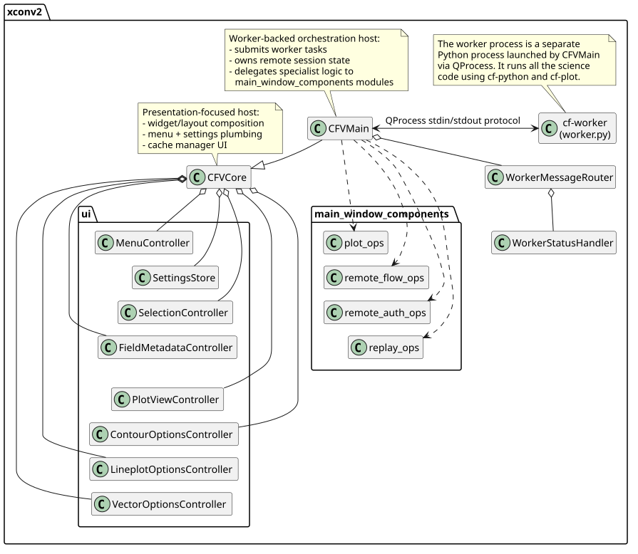
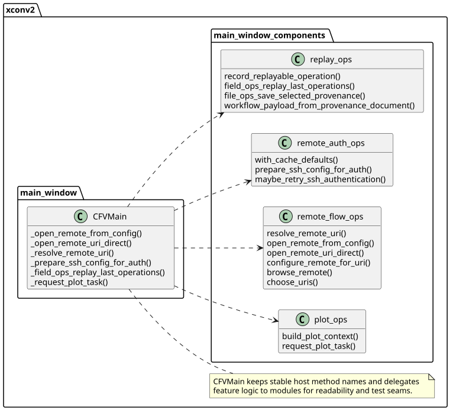
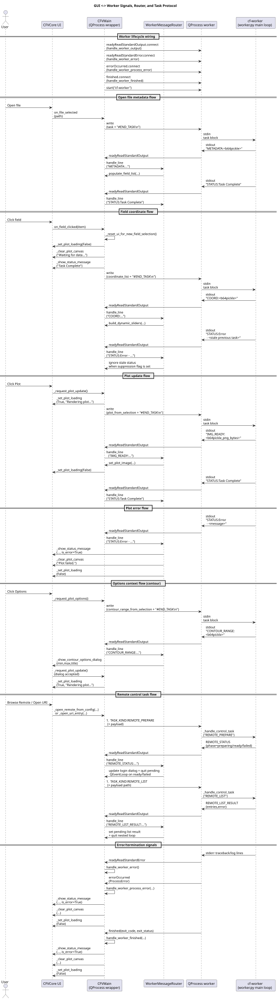
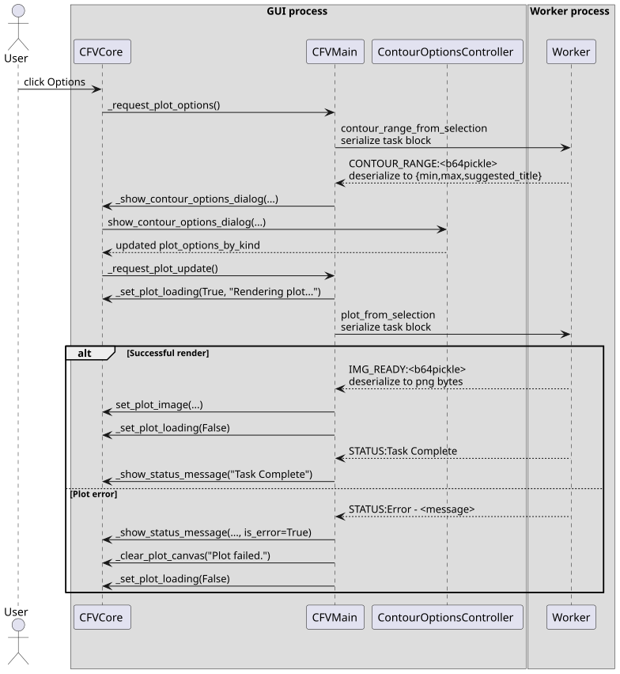

# Core and Main Window Architecture

This note reflects the current split between presentation (`CFVCore`) and
worker-backed orchestration (`CFVMain`).

## Current architecture

The app is now intentionally layered:

- `xconv2/core_window.py` (`CFVCore`):

  - Pure GUI composition, controller wiring, menu/status plumbing, cache manager UI,
    recent-file UX, and local settings/state helpers.

- `xconv2/main_window.py` (`CFVMain`):

  - Worker process lifecycle (`QProcess`), IPC request submission, worker message
    routing integration, and orchestration methods called from menu/actions.

- `xconv2/worker_message_router.py`:

  - Parses worker stdout protocol lines and dispatches by message type.
  - `WorkerStatusHandler` centralizes `STATUS:` behavior and plot/task completion
    side effects.

- `xconv2/main_window_components/*.py`:

  - Feature-specific helper modules used by thin `CFVMain` wrappers.
  - Current modules:
    - `plot_ops.py`
    - `remote_flow_ops.py`
    - `remote_auth_ops.py`
    - `replay_ops.py`

- `xconv2/ui/*.py` controllers:

  - `MenuController`, `SelectionController`, `FieldMetadataController`,
    `PlotViewController`, `ContourOptionsController`, `LineplotOptionsController`,
    `VectorOptionsController`, `SettingsStore`.

## Why this layout

- `CFVCore` stays presentation-focused and can be reasoned about as a GUI shell.
- `CFVMain` keeps worker orchestration in one host class, while high-churn feature
  logic moves into focused component modules.
- Method names in `CFVMain` remain stable wrappers, preserving test seams and
  monkeypatch points for integration-style tests.

## UML

Class map:

Source: `docs/uml/alpha_core_window.pu`

Main-window component map:

Source: `docs/uml/main_window_component_map.pu`

GUI-worker protocol and routing flow:

Source: `docs/uml/core_window_gui_worker_signals.puml`

Options flow (worker range fetch -> dialog -> render):

Source: `docs/uml/core_window_options_sequence.puml`

## Notes for future refactors

- Keep `CFVMain` methods as stable delegating wrappers when extracting logic,
  so tests can continue patching host methods.
- Prefer module-level helper imports (as used now) over many per-function imports
  for readability at the top of `main_window.py`.
- If additional host classes are introduced later, re-evaluate whether some
  component helpers should become reusable classes or protocols.
