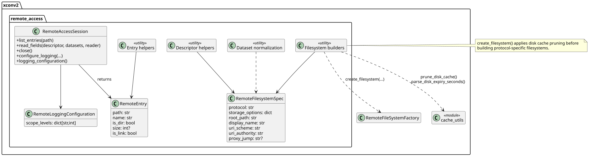

# Remote Cache and Pruning (Current)

This note reflects the current cache behavior in the refactored UI/worker layout.

## Scope

Cache settings are captured in remote configuration UI and propagated through the
descriptor used for worker-side remote sessions.

Primary code paths:

- `xconv2/ui/dialogs.py` (cache config controls)
- `xconv2/remote_access.py` (`create_filesystem`)
- `xconv2/cache_utils.py` (usage + pruning)
- `xconv2/core_window.py` (cache manager + prune/flush actions)

## Implemented behavior

### 1) Cache controls in configuration

The remote configuration dialog persists disk cache options:

- `disk_mode`: `Disabled`, `Blocks`, `Files`
- `disk_location`
- `disk_limit_gb`
- `disk_expiry`: `Never`, `1 day`, `7 days`, `30 days`

These are included in the worker descriptor payload (`cache` object).

### 2) Worker-side cache preparation

When worker control tasks prepare/open a remote session, filesystem creation goes
through `xconv2.remote_access.create_filesystem(...)`.

If `disk_mode` is `blocks` or `files`, the worker first prunes the configured
cache directory using `prune_disk_cache(...)`, then constructs protocol-specific
filesystem wrappers via `RemoteFileSystemFactory`.

### 3) Pruning policy

`xconv2.cache_utils.prune_disk_cache(...)` applies:

- expiry pruning (`mtime` older than configured expiry)
- size-limit pruning (oldest files first until under limit)

It then rewrites fsspec cache metadata entries to drop payloads that no longer
exist, and returns a summary (`removed_files`, `removed_bytes`, totals).

### 4) Cache Manager UI

`Xconv -> Manage Cache...` opens `CacheManagerDialog`.

Available operations:

- Refresh cache summary and per-remote rows
- Prune configured cache (`_prune_configured_disk_cache`)
- Flush configured cache (`_flush_configured_disk_cache`)
- Flush per-remote location rows where enabled

Before prune/flush, the UI attempts to release active remote worker sessions to
avoid stale handles.

## Operational notes

- Pruning is not background/continuous; it runs during filesystem creation and
  when triggered manually from the cache manager.
- Size enforcement is file-level best effort.
- SSH rows in cache manager are currently marked non-flushable in the per-remote
  table because SSH disk-cache behavior is constrained by current remote-fs path.
- If external processes modify the cache directory concurrently, metadata/index
  consistency is best-effort and repaired on later prune/open cycles.

## UML

Source: `docs/uml/remote_access_module.puml`
