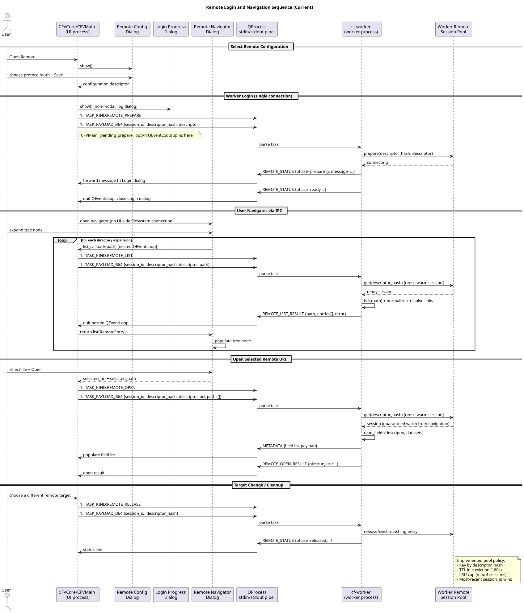

# Remote Navigation and Worker Warmup (Current)

This document captures the current UI/worker contract for remote browsing,
session warmup, remote open, and related control tasks.

## Process model

1. UI process (`CFVCore` + `CFVMain`): dialogs, menu/actions, pending loops.
2. Worker process (`cf-worker`): remote session pool, remote filesystem access,
   field operations, plotting, provenance/replay control tasks.

`CFVMain` delegates most remote flow/auth helpers to
`xconv2/main_window_components/*`, while stdout message dispatch is handled by
`WorkerMessageRouter`.

## Remote flow ownership

### UI-side orchestration

- `remote_flow_ops.py`: open/browse/configure URI flows, nested loop control,
  and URI -> remote descriptor/path resolution (`resolve_remote_uri`).
- `remote_auth_ops.py`: SSH auth probing, prompt/retry behavior, proxyjump secrets.

### Worker-side execution

- `worker.py` control-task handler (`_handle_control_task`).
- `remote_access.py` filesystem spec/creation and `RemoteAccessSession` facade.

## Implemented navigation behavior

1. User chooses remote target/config or URI.
2. UI sends `REMOTE_PREPARE` and waits in a pending `QEventLoop`.
3. Worker emits `REMOTE_STATUS` (`preparing`/`ready`/`failed`) updates.
4. Browser expansions call `REMOTE_LIST`; results return via `REMOTE_LIST_RESULT`.
5. Open sends `REMOTE_OPEN`; metadata returns through `METADATA` and open status
   through `REMOTE_OPEN_RESULT`.
6. Target changes/cleanup send `REMOTE_RELEASE`.

No persistent UI-side filesystem is created for worker-backed browsing.

## Control-task protocol

UI -> worker task preamble headers:

1. `#TASK_KIND:<kind>`
2. `#TASK_PAYLOAD_B64:<base64-json>`

Main remote kinds:

- `REMOTE_PREPARE`
- `REMOTE_LIST`
- `REMOTE_OPEN`
- `REMOTE_RELEASE`

Other current control kinds relevant to architecture:

- `LOGGING_CONFIGURE`
- `REPLAY_FIELDS`
- `SAVE_PROVENANCE`

Worker -> UI structured messages:

- `REMOTE_STATUS`
- `REMOTE_LIST_RESULT`
- `REMOTE_OPEN_RESULT`
- `METADATA` / `METADATA_APPEND`
- `STATUS`

## Worker session-pool policy

`worker.py` maintains descriptor-hash keyed entries (`RemoteSessionEntry`) with:

- `session_id`
- `created_at`
- `last_used`

Current constants:

- idle TTL: `REMOTE_SESSION_TTL_SECONDS = 180`
- max pool size: `REMOTE_SESSION_MAX = 4`

When a descriptor already exists, the session is reused and `session_id` is
updated (most recent request wins).

## Dataset-open strategy (current)

Remote opens now route through `RemoteAccessSession.read_fields(...)`, which
opens dataset handles from the prepared filesystem and passes those handles to
`cf.read(...)`.

This is different from older docs that described SSH temp-file staging as the
default path.

## UML

Remote warmup/list/open sequence:

Source: `docs/uml/remote_worker_warmup_sequence.puml`

GUI-worker router/protocol flow:

Source: `docs/uml/core_window_gui_worker_signals.puml`
